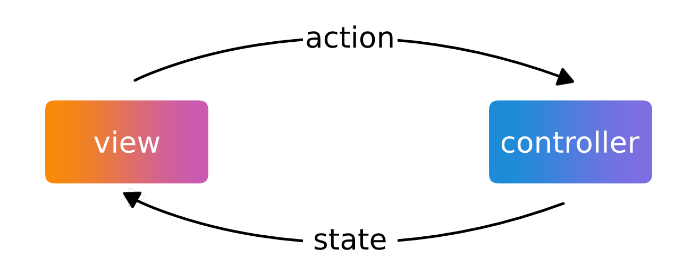

<p align="center"></p>

<p align=center>
    <a href="https://bintray.com/flosch/control/control-core"></a> 
    <a href="LICENSE"></a>
</p>

<p align=center>
    <a href="https://github.com/floschu/control/"></a>
    <a href="https://www.codacy.com/manual/floschu/control?utm_source=github.com&amp;utm_medium=referral&amp;utm_content=floschu/control&amp;utm_campaign=Badge_Grade"></a>
    <a href="https://codecov.io/gh/floschu/control"></a>
    <a href="https://github.com/floschu/control/actions"></a>
</p>

## installation

``` groovy
repositories {
    jcenter()
}

dependencies {
    implementation("at.florianschuster.control:control-core:$version")
}
```

## controller

<p align="center"></p>

A [Controller](control-core/src/main/kotlin/at/florianschuster/control/Controller.kt) is an ui-independent class that controls the state of a view. The role of a `Controller` is to separate business-logic from view-logic. A `Controller` has no dependency to the view, so it can easily be unit tested.

## info & documentation

1. [controller](https://github.com/floschu/control/wiki/controller)
2. [view](https://github.com/floschu/control/wiki/view)
3. [transformations](https://github.com/floschu/control/wiki/transformations)
4. [controller testing](https://github.com/floschu/control/wiki/controller-testing)
5. [view testing](https://github.com/floschu/control/wiki/view-testing)
6. [logging](https://github.com/floschu/control/wiki/logging)

the changelog can be found [here](https://github.com/floschu/control/blob/develop/CHANGELOG.md)

## examples

*   [counter](examples/example-counter): most basic example. uses `Controller`.
*   [github search](examples/example-github): github repository search. uses `Controller` combined with _Android Jetpack AAC_ `ViewModel`.
*   [counter compose](https://github.com/floschu/control/pull/9): like the counter example, but uses _Jetpack Compose_.

## coverage

test coverage is automatically run by github actions on `[push]`

|  | threshold | run | output |
|---:|:---:|---|---|
| instruction/branch | 90% | `./gradlew test jacocoTestReport` | `./control-core/build/reports/jacoco/` |
| mutation | 100% | `./gradlew pitest` | `./control-core/build/reports/pitest/` |


## author

visit my [website](https://florianschuster.at/).
